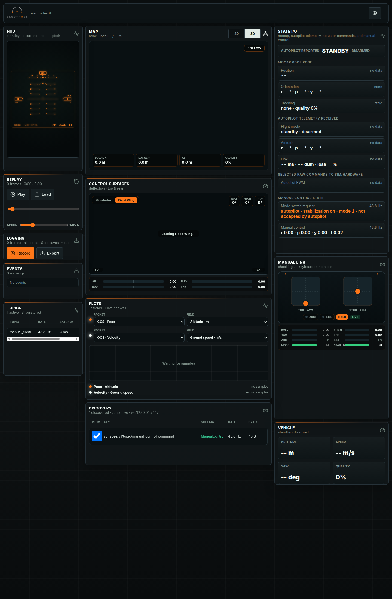
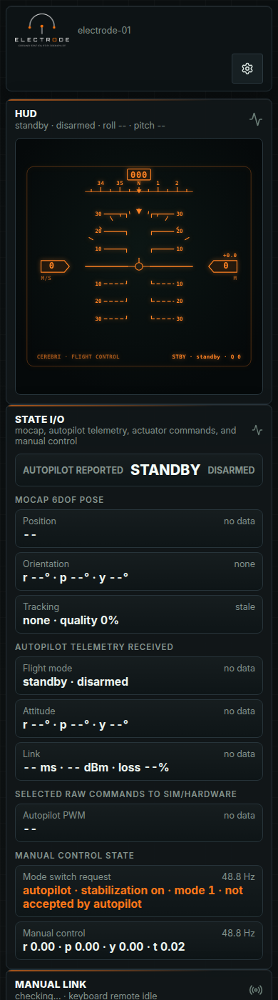

# Using The UI

This page is a tour of the Electrode screen in static Viewer mode. Viewer mode
is what the GitHub Pages build shows when no local Ground Station daemon is
present. When the app is served by `electrode-ground-station`, extra Dashboard
configuration, Firmware, and SIM controls appear.

## First Read

Use the screen from top left to bottom right:

1. Check the header for the active vehicle id and the theme/settings menu.
2. Check **State I/O** for whether expected Synapse topics are arriving.
3. Use **HUD**, **Map**, and **Vehicle** for quick flight-state awareness.
4. Use **Manual Link** and **Control Surfaces** to verify operator input and
   selected actuator output.
5. Use **Plots**, **Discovery**, **Topics**, **Replay**, and **Logging** when
   debugging or recording a session.

## Header

The header shows the Electrode mark, the current vehicle id, and the settings
menu. The settings menu currently contains the light/dark theme toggle.

If the vehicle id is not the vehicle you expect, confirm the app was opened
with the intended backend or Zenoh stream source.

## HUD

The **HUD** is the quickest attitude readout. It summarizes standby/arming,
roll, and pitch in the panel subtitle, then renders a flight-display style view
with heading, pitch ladder, roll marker, speed, and altitude.

When telemetry is missing, the subtitle shows `--` values. Treat that as a data
path problem before debugging the visualization itself.

## Map

The **Map** panel is the position view. The `2D`/`3D` switch changes between a
flat mission-style map and the local 3D scene. `Follow` recenters the view on
the vehicle.

The bottom chips show local X, local Y, altitude, and localization quality.
If quality is `0%` or the subtitle says `no fix`, check mocap/GNSS/local-pose
topics in **State I/O** and **Discovery**.

## State I/O

**State I/O** is the data-contract panel. It groups the key flows Electrode
expects:

- **Autopilot reported**: vehicle mode and arming status.
- **Mocap 6DOF pose**: position, orientation, and tracking freshness.
- **Autopilot telemetry received**: flight mode, attitude, and link data.
- **Selected raw commands to sim/hardware**: actuator/PWM command stream.
- **Manual control state**: mode-switch request and manual-control values.

Use this panel first when a downstream panel looks wrong. If State I/O says
`no data` or `stale`, the UI is faithfully reporting that the topic has not
arrived or has timed out.

## Replay

**Replay** loads MCAP recordings and feeds them through the same worker/state
pipeline used by live data. Use the play/pause button, load button, timeline,
and speed slider to inspect previous sessions.

Replay is useful for UI work because it lets you reproduce a vehicle state
without hardware.

## Logging

**Logging** records live topics into MCAP. Press **Record** before the event you
want to capture, press it again to stop, then **Export** to download the file.

The counter reports how many frames are buffered. A stopped recording is what
saves the `.mcap` export cleanly.

## Events

**Events** is the short operational log. Warnings and errors appear here when
the state store or bridge observes something the operator should notice.

If the UI looks quiet but behavior feels wrong, check this panel before opening
developer tools.

## Topics

**Topics** lists active registered topic snapshots with rate and latency. It is
a compact way to see whether Electrode knows about a stream, how fast it is
arriving, and whether it is late.

In Viewer mode with no backend or Zenoh stream, this panel is expected to say
`No topics`.

## Control Surfaces

**Control Surfaces** visualizes the currently selected command output as
aircraft deflections. Switch between **Quadrotor** and **Fixed Wing** to match
the vehicle model you are inspecting.

Use this beside **Manual Link**: Manual Link shows operator intent, while
Control Surfaces shows what that intent or selected autopilot output becomes.

## Plots

**Plots** graphs selected fields from live or replayed packets. Choose a packet
and field for each trace, then watch the plot and legend for last values and
ranges.

Start with altitude and ground speed when checking whether replay/live decoding
is working. Add attitude, link, or control fields once the basic stream is
healthy.

## Discovery

**Discovery** shows raw observed Zenoh keys, schemas, rates, and byte counts.
Use it when a stream exists but Electrode is not decoding it into a higher-level
panel.

The usual debugging sequence is:

1. Confirm the key appears in Discovery.
2. Confirm the schema/bytes look plausible.
3. Confirm the matching State I/O row is fresh.
4. Then inspect the visual panel that consumes that state.

## Manual Link

**Manual Link** displays controller sticks, arm/kill state, signal state, axis
values, and the manual-control topic it is waiting for.

In Ground Station mode, this panel can compare hardware joystick input and
Zenoh manual-control messages. In static Viewer mode it can only show Zenoh
state, so `NO SIGNAL` is expected until data arrives.

## Vehicle

**Vehicle** is the compact summary: altitude, speed, yaw, and quality. It is
the panel to glance at when the larger HUD/Map panels are off screen.

If **Vehicle** disagrees with **HUD** or **Map**, prefer **State I/O** as the
source of truth and check whether one of the panels is using stale data.

## Mobile Layout

The same panels collapse into a single-column scanning flow on narrow screens.
The order is intentionally status-first: header, HUD, State I/O, and then the
rest of the operational/debug panels.

## Ground Station Screenshots

The screenshots above are static Viewer screenshots. To document Ground
Station-only controls precisely, capture the app while it is served by
`electrode-ground-station` with your normal hardware or simulation profile
active. Useful captures are:

- Dashboard with the Ground Station status bar and Dashboard config open.
- Firmware tab with the selected autopilot profile.
- SIM tab with the model editor visible.
- Manual Link with a real controller connected.
- Plots while replay or simulation samples are flowing.

Those screenshots can be dropped into `docs/assets/ui/` and referenced from
this page.
